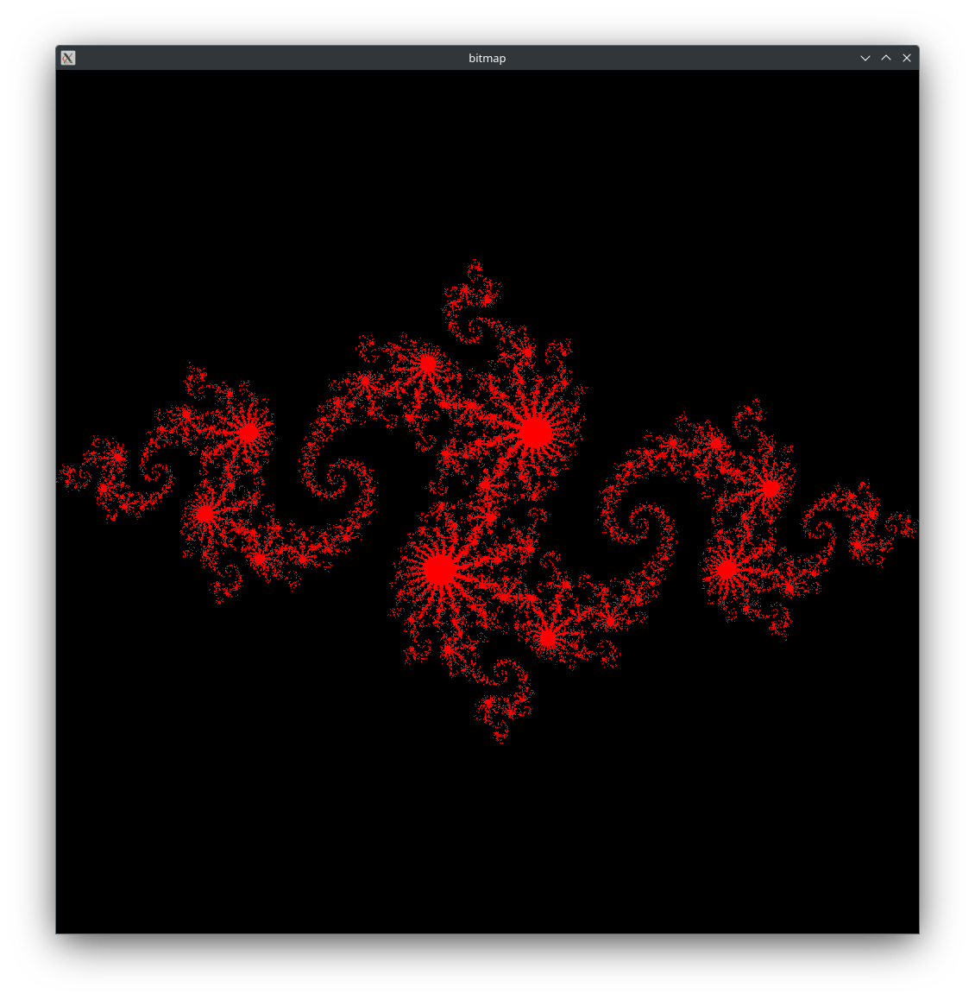
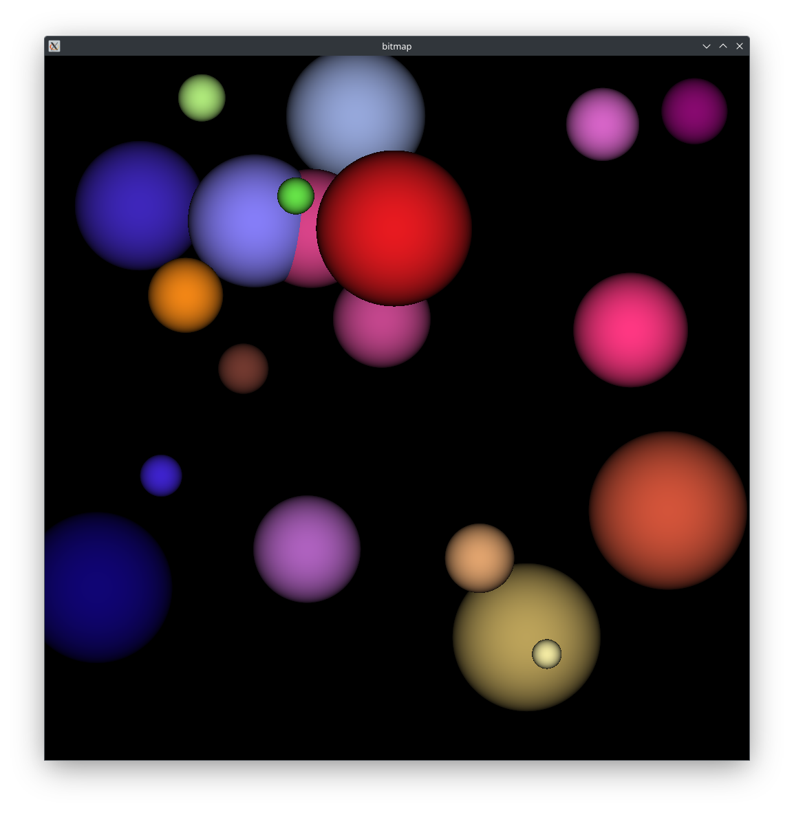

# SYCL examples

Some simple SYCL code.

## N-body Maxwell-Boltzmann distribution

Uses N-body simulation to
approximate [Maxwell-Boltzmann distribution](https://en.wikipedia.org/wiki/Maxwell%E2%80%93Boltzmann_distribution).

## Ripple

SYCL rewrite
of [CUDA code](https://github.com/CodedK/CUDA-by-Example-source-code-for-the-book-s-examples-/blob/master/chapter05/ripple.cu)
in the "CUDA By Example" book.

## Julia set

SYCL rewrite
of [CUDA code](https://github.com/CodedK/CUDA-by-Example-source-code-for-the-book-s-examples-/blob/master/chapter04/julia_gpu.cu)
in the "CUDA By Example" book.

## Ray tracing

SYCL rewrite
of [CUDA code](https://github.com/CodedK/CUDA-by-Example-source-code-for-the-book-s-examples-/blob/master/chapter06/ray.cu)
in the "CUDA By Example" book.

